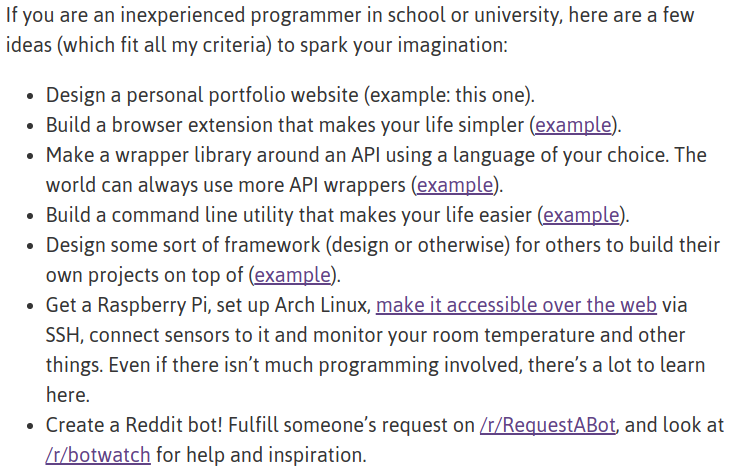
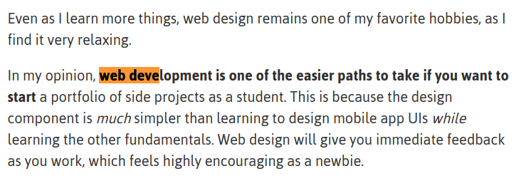

 

# project-ideas for side projects 

Best article so far - http://antrikshy.com/blog/how-i-got-started-with-programming-side-projects

Project ideas, ideally for students who are looking to execute mini or final year projects. 

If you are interested and would like access to resources (including 24-hour web access, hardware, etc.)
please write to pramyaen@gmail.com requesting for the same. 

### Misc 
How to ask question on forums - http://www.catb.org/esr/faqs/smart-questions.html

### Inspiration 

 

