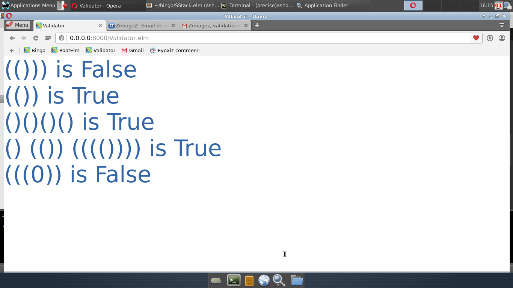

### Validator 

  

```elm 
module Validator where

-- import Html exposing (..)
import Text exposing (..)
import Graphics.Element exposing (..)
import Color exposing (..)

import SStack as Stack exposing (..)

reverseString : String -> String
reverseString str =
  Stack.reverse str 

invalidString: String
invalidString = 
    "(()))"

validString: String
validString = 
    "(())"

validateString: String -> Bool 
validateString s = 
    validate s Stack.empty

resultString : String -> Element
resultString s = 
    s ++ " is " ++ toString (validateString s)
      |> Text.fromString
      |> Text.color Color.blue
     -- |> Text.bold
      |> Text.height 60
      |> centered 

testExpressions: List String
testExpressions = 
  [
    invalidString,
    validString, 
    "()()()()",                -- valid
    "() (()) (((())))",        -- valid
    "(((0))"                   -- not valid
  ]

main : Element
main =
  -- (reverseString "Hello World !") ++ " " ++ 
  {- List.map (\s -> resultString s) testExpressions
    |> Text.concat 
    |> Html.text
  -}
  flow down (List.map resultString testExpressions )
  

```
