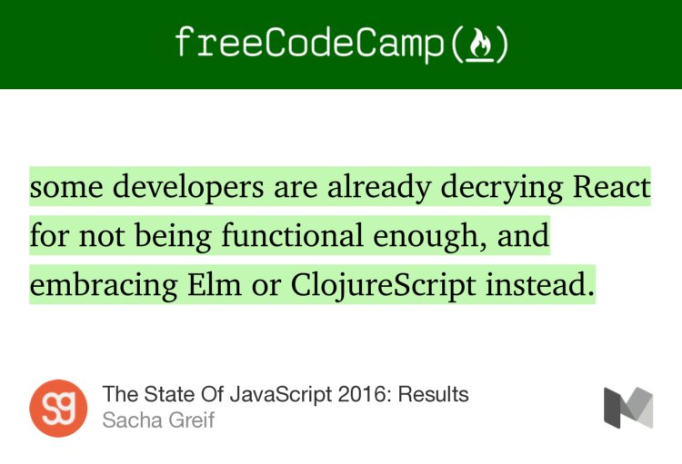

# An Elm-based MIS report for CloudCoder 

The objective of this project is to demonstrate skills in Elm 
to develop a front end Single Page Application. 

Adding some Elm to your JS project - http://tech.noredink.com/post/126978281075/walkthrough-introducing-elm-to-a-js-web-app

Elm CONSOLE ON THE Web: http://elm-lang.org/try

Learn to build your first app  http://tech.noredink.com/post/129641182738/building-a-live-validated-signup-form-in-elm 

### Awesome list for Elm Tutorials and projects 
https://github.com/isRuslan/awesome-elm

# Online Help for learning the language
http://package.elm-lang.org/packages/elm-lang/core/3.0.0  
https://elmlang.slack.com - watering hole for helpful Elm developers  
https://groups.google.com/forum/#!forum/elm-discuss - Google Groups for Elm  
http://codereview.stackexchange.com/questions/tagged/elm - Code review on SO  

# INSPIRATION 

The **next** trend: 
Structured -> Object-oriented -> Functional (Map-reduce, etc) -> Functional Reactive (for the web). 

### Who rules over the Front-end ruler (React)? 
<blockquote class="twitter-tweet" data-lang="en">
“The State Of JavaScript 2016: Results” — <a href="https://twitter.com/SachaGreif">@SachaGreif</a> <a href="https://t.co/T1u0AFthSl">https://t.co/T1u0AFthSl</a> <a href="https://twitter.com/hashtag/elmlang?src=hash">#elmlang</a> <a href="https://t.co/lvfIKWSb5F">pic.twitter.com/lvfIKWSb5F</a>
&mdash; ashok (@lifebalance) <a href="https://twitter.com/lifebalance/status/785926841571966977">October 11, 2016</a></blockquote>

The Elm Language is probably a good idea to learn by students who are US-bound. It is a new language, and capturing the imagination of several developers in that country. Even otherwise, one of the other benefits is that if you learn Elm, you will be a better Front-end Javascript developer.

- Why Reactive Programming Is Not a Fad
"Reactive Programming yields faster processing times and better use of hardware, which results in cheaper operating costs; many large-scale systems in use today are based on the principles of the Reactive Manifesto.” http://buff.ly/1RyCNMv

- A Desktop App using Elm and Electron (https://github.com/mdgriffith/elm-electron-todomvc)
- 10 battles raging for the hearts and minds of developers http://j.mp/battleKG 
  - Which language to learn for the web? - http://qr.ae/8sN75w
- Elm makes you Happy (slides) - http://j.mp/elmHappy
- Four Reasons to learn Elm - http://j.mp/whyLearnElm
- https://www.youtube.com/watch?v=fhMLEOr8C4U - an artist builds a graphical program! 
- A Eml-based search engine - first [draft](/search.eml.md)
-    - Browser based storage - https://github.com/kgisl/elm-storage
-    - Http extra - http://package.elm-lang.org/packages/lukewestby/elm-http-extra/5.2.0/Http-Extra
- Learn X in Y minutes, where X=Elm https://learnxinyminutes.com/docs/elm/
- EML community has great developers http://elm-lang.org/community
- Other Elm Project ideas - https://github.com/elm-community/builtwithelm
- Time Travel Debugger - http://elm-lang.org/blog/time-travel-made-easy
