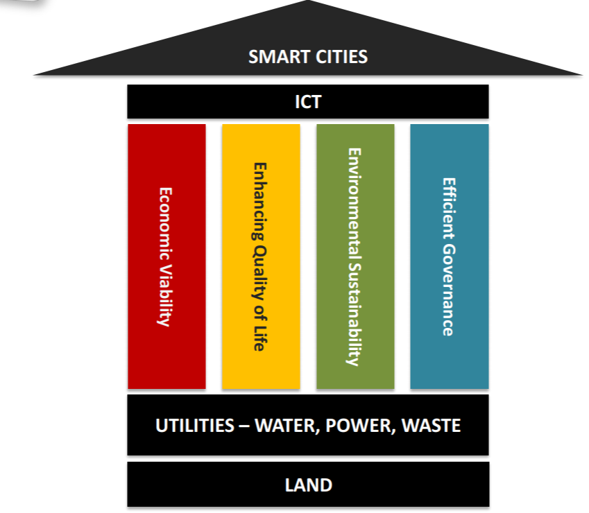

# Smart City Projects 

Read up on the Smart City value proposition by Singapore - http://j.mp/smartSingapore

Smart Cities Hackathons are coming up all over the country. KGISL Educational institutions + FCC 
can take the lead on organising one such Hackathon in Coimbatore in the near future.

1. Read up on how Singapore believes it can help India's smart city initiative.
2. Choose a `pillar` - an area and sub-area of interest (Viability, Quality of Life, Environment, Governance)
    - Healthcare, for example, is a sub-area under the "Quality of Life" pillar
3. Pick a project in the area of interest and create a proof-of-concept (POC)

FOUR MAIN PILLARS of Smart Cities

